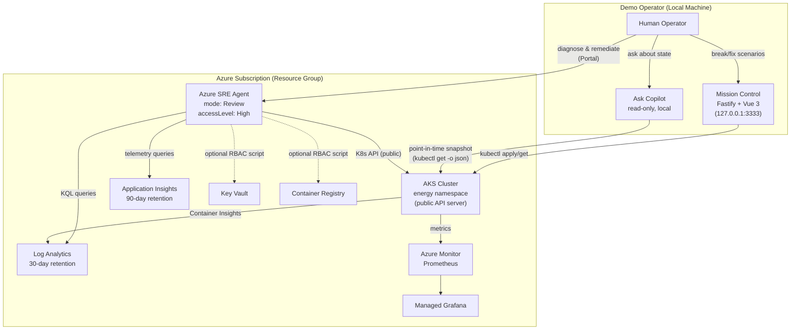
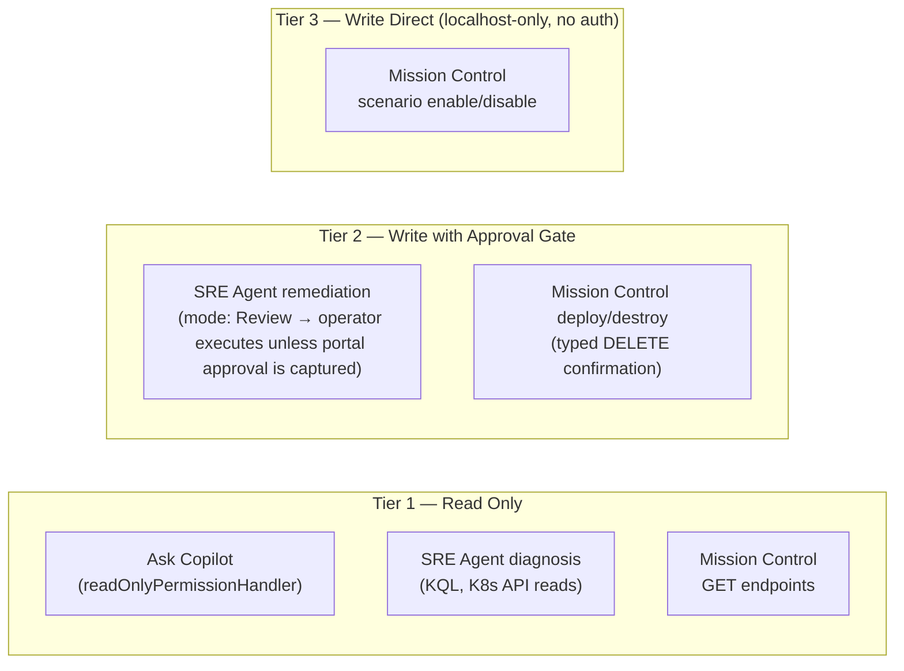
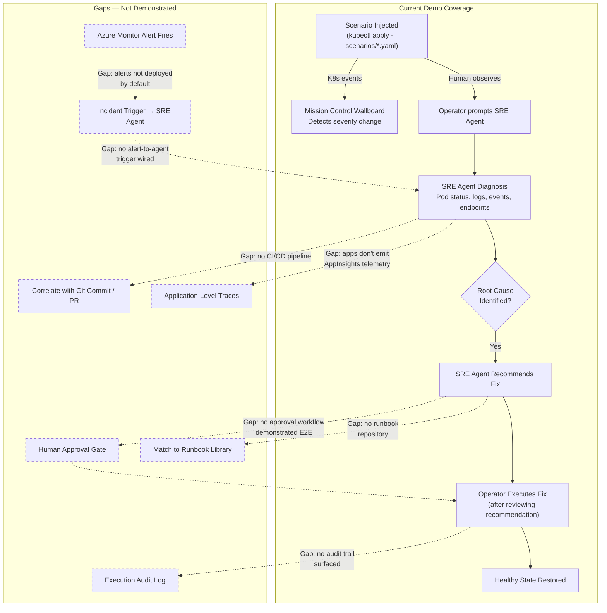
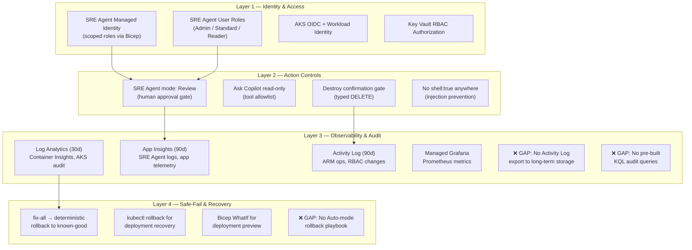

# Azure SRE Agent Service Demo — Customer Readiness Delta Analysis

> **Version**: 1.0 &middot; **Date**: 2026-04-25 &middot; **Status**: Azure SRE Agent is **GA** (lab API pin: `Microsoft.App/agents@2026-01-01`, Stable channel)
> **Applicable regions**: East US 2, Sweden Central, Australia East
> **Repo**: [`johnstel/azure-sre-agent-energy-grid`](https://github.com/johnstel/azure-sre-agent-energy-grid)

---

## 1 · Executive Summary

The Azure SRE Agent Energy Grid demo lab deploys a fully automated Azure environment — AKS cluster, eight-service energy grid application, full observability stack (Log Analytics, Application Insights, Managed Grafana, Prometheus), and the Azure SRE Agent resource — from a single Bicep deployment in approximately 20 minutes. Ten breakable scenarios simulate realistic infrastructure failures, and curated prompt libraries guide diagnosis through remediation.

**Strongest proof points for customers:**

| Proof Point | Evidence |
|-------------|----------|
| **Human-in-the-loop by default** | SRE Agent deploys with `mode: 'Review'`; this demo presents write actions as recommendation-only until a real approval UI/API is captured. |
| **Three-tier action model** | Azure SRE Agent (cloud, review/recommendation mode) · Mission Control API (local, confirmation-gated; out of scope as Azure SRE Agent proof) · Ask Copilot (local, strictly read-only) — clear trust separation |
| **Full IaC reproducibility** | Single `deploy.ps1` provisions all infrastructure via Bicep; deterministic, auditable, teardown-safe |
| **10 deterministic failure scenarios** | Each scenario injects a discrete, well-documented failure mode with curated prompt progressions from open-ended → specific → remediation |

**Top deltas that must be addressed:**

| Priority | Delta | Impact |
|----------|-------|--------|
| **P0** | Architecture and permission-boundary diagrams exist in this document but have not been promoted to the README, demo deck, or customer handout | Customers need the trust model visible in every customer-facing artifact |
| **P0** | `mode: 'Review'` vs `mode: 'Auto'` trade-off is not documented for customers | Cannot answer the #1 customer question: "Can it auto-remediate?" |
| **P0** | Alert rules default to off (`deployAlerts = false`); no alert-to-agent trigger is wired | Cannot demonstrate autonomous detection or alert querying |
| **P0** | No SRE Agent audit trail evidence (screenshots, KQL queries, or dashboards) | Cannot answer "Show me what the agent did" |
| **P1** | No MTTR instrumentation, no SLO/error-budget framework | Value story is qualitative only |
| **P1** | Demo apps do not emit Application Insights telemetry | Application-level observability prompts return thin results |

---

## 2 · How to Read This Document

This document follows the [Diátaxis](https://diataxis.fr/) framework. The body (§3–§5) is **explanation** — it builds a mental model of the demo's architecture, SRE use-case coverage, and security posture. Section 6 is a **reference** appendix — a lookup table of gaps ranked by priority.

### Status Legend

| Icon | Meaning |
|------|---------|
| ✅ **Covered** | Implemented in the repo and demonstrable to customers with evidence |
| ⚠️ **Partial** | Partially implemented or documented — needs additional work for a complete customer story |
| ❌ **Gap** | Not implemented or documented — creates a risk of unanswerable customer questions |

### Priority Labels

| Label | Definition |
|-------|------------|
| **P0** | Must address before the next customer demo or to answer core Q&A safely |
| **P1** | Should address for stronger enterprise readiness and credible production conversations |
| **P2** | Hardening, roadmap, and polish items |

### Section Map

| Section | Reader Goal |
|---------|-------------|
| **§3 Architecture & Control Model** | Understand what is deployed, what each component can do, and where trust boundaries lie |
| **§4 Core SRE Use Cases** | Evaluate which SRE workflows the demo proves and where gaps remain |
| **§5 Security, Risk & Auditability** | Assess whether the demo answers enterprise security and compliance questions |
| **§6 Priority Delta Backlog** | Plan which gaps to close and in what order |
| **§7 Evidence Appendix** | Find source files, Bicep modules, and documentation backing each claim |

---

## 3 · Architecture & Control Model

### 3.1 High-Level Architecture

The demo deploys a three-tier, fully-IaC architecture via a single `main.bicep` at subscription scope:

| Layer | Resources | IaC Reference |
|-------|-----------|---------------|
| **Compute** | AKS (Standard tier, public API, Azure CNI + Calico, OIDC + Workload Identity, Container Insights, Azure Policy addon, Key Vault Secrets Provider) | `infra/bicep/modules/aks.bicep` |
| **Application** | 8 microservices in `energy` namespace: grid-dashboard (Vue.js), ops-console (Vue.js), meter-service (Node.js), asset-service (Rust), dispatch-service (Go), load-simulator (Python), RabbitMQ, MongoDB | `k8s/base/application.yaml` |
| **Observability** | Log Analytics (30-day retention), App Insights (90-day retention), Managed Grafana, Azure Monitor Prometheus, 4 scheduled-query alert rules (opt-in) | `infra/bicep/main.bicep:134-268` |
| **SRE Agent** | `Microsoft.App/agents@2026-01-01` with `upgradeChannel: 'Stable'`, user-assigned managed identity, `accessLevel: 'High'`, `mode: 'Review'` | `infra/bicep/modules/sre-agent.bicep:76-108` |
| **Mission Control** | Local-only Fastify 5 + Vue 3 SPA. Includes "Ask Copilot" assistant (read-only, GitHub Copilot SDK). Binds to `127.0.0.1:3333`. | `mission-control/README.md` |

**Key distinction**: Azure SRE Agent is the cloud-side AI diagnostic and remediation service (the product being demonstrated). Mission Control is a local demo cockpit for launching scenarios and viewing wallboard state. They share the same AKS cluster and observability stack but have no direct integration with each other.

> **Evidence**: `mission-control/README.md:73-77` explicitly documents this two-agent boundary.

#### Architecture Diagram



> ✅ **Covered in this document / P0 for demo materials**: The repo previously had no customer-facing architecture diagram. This document adds one; the remaining delta is to reuse it in the README, demo deck, or customer handout.
>
> **Access note**: Key Vault and ACR access for the SRE Agent managed identity depends on running the optional `scripts/configure-rbac.ps1` role-assignment flow; it is not fully established by the SRE Agent Bicep resource alone.

### 3.2 Data Sources and Signals

SRE Agent consumes data from these Azure-provisioned sources:

| Data Source | What SRE Agent Reads | Access Method | Evidence |
|-------------|---------------------|---------------|----------|
| **AKS Cluster (live K8s API)** | Pod status, events, logs, deployments, services, endpoints | Managed identity + RBAC roles (AKS Cluster Admin, AKS RBAC Cluster Admin) | `SRE-AGENT-SETUP.md:80-89` |
| **Log Analytics Workspace** | `KubePodInventory`, `KubeEvents`, `ContainerLog`, pod lifecycle data | Log Analytics Reader role | `sre-agent.bicep:40` |
| **Application Insights** | Application telemetry, request traces, exceptions | Connected via `appInsightsAppId` + `connectionString` in `logConfiguration` | `sre-agent.bicep:97-100` |
| **Azure Monitor / Prometheus** | Cluster-level metrics (CPU, memory, network) | Reader + Contributor roles on RG | `infra/bicep/modules/observability.bicep` |
| **Managed Grafana** | Dashboard visualization (not directly queried by SRE Agent, but accessible) | Connectable via portal | `SRE-AGENT-SETUP.md:128-129` |

**Mission Control's data scope** is separate and local-only:
- `MissionStateService.ts` collects preflight status, pods, services, deployments, and events from the `energy` namespace via `kubectl get -o json`
- `AssistantService.ts` explicitly enumerates `STATE_SOURCES`: preflight, energy namespace K8s objects, scenario catalog, job status

| Status | Assessment |
|--------|------------|
| ✅ | Full observability stack deployed automatically via IaC |
| ✅ | Four alert rules defined in `alerts.bicep` (pod restarts, HTTP 5xx, pod failures, CrashLoop/OOM) |
| ⚠️ | `managedResources: []` in SRE Agent Bicep — connected resources must be added manually via portal (Preview API limitation) |
| ⚠️ | Alerts default to off (`deployAlerts = false` in `main.bicep:32`) — must opt in |
| ❌ | Demo apps do not emit custom Application Insights telemetry — only infrastructure-level signals are rich |

### 3.3 Decision and Reasoning Loop

The demo does **not** expose SRE Agent's internal reasoning loop — it relies entirely on the Azure SRE Agent service's built-in chain-of-thought. The demo's contribution to the reasoning story is:

1. **Curated prompt library** — `SRE-AGENT-PROMPTS.md` (190+ lines) and `PROMPTS-GUIDE.md` structure prompts by SRE discipline: troubleshooting → monitoring → incident response → capacity → security → remediation → scheduled tasks
2. **Staged prompt escalation** — Each scenario follows a five-stage pattern: open-ended → direct → specific → remediation → action
3. **Deterministic failure modes** — 10 breakable scenarios create known failure states for SRE Agent to reason about
4. **Mission Control's Ask Copilot** — Local reasoning loop: collects state snapshot → injects as tool result → model explains and triages. Explicit about being "read-only v1" (`AssistantService.ts:29-37`)

| Status | Assessment |
|--------|------------|
| ✅ | Prompt library is comprehensive and demo-ready |
| ✅ | Five-stage escalation pattern demonstrates autonomous discovery |
| ⚠️ | No visibility into SRE Agent's tool-calling chain, query sequence, or hypothesis ranking |
| ❌ | No documentation of SRE Agent's reasoning architecture (LLM orchestration, context window management) — this is a platform-level gap, not a demo gap |

### 3.4 Action Model

This is the most precisely documented area of the demo. Three distinct action models exist:

#### Action Model Trust Tiers



**Azure SRE Agent** — `mode: 'Review'` (operator-controlled remediation in this demo):
```bicep
// sre-agent.bicep:92-96
actionConfiguration: {
  accessLevel: accessLevel    // 'High' = Reader + Contributor + Log Analytics Reader
  identity: managedIdentity.id
  mode: 'Review'              // Agent recommends; operator executes unless portal approval evidence is captured
}
```

With `accessLevel: 'High'`, the managed identity holds: Log Analytics Reader + Reader + **Contributor** (RG-scoped). Additional roles granted via RBAC script: AKS Cluster Admin, AKS RBAC Cluster Admin, AKS Contributor, Log Analytics Reader, Key Vault Secrets Officer, AcrPull.

**Mission Control Backend** — Mixed read/write with confirmation gates:
- Read: `GET /api/pods`, `GET /api/services`, `GET /api/events`, `GET /api/deployments` via structured `execFile()` (no `shell: true`)
- Write: Scenario enable/disable, deploy, destroy — with `"DELETE"` confirmation for destructive operations and one-destructive-job-at-a-time limits

**Ask Copilot** — Strictly read-only:
- `readOnlyPermissionHandler` rejects every tool except `get_mission_control_state` (`AssistantService.ts:77-86`)
- System message prohibits claiming it deployed, destroyed, or repaired anything
- Excludes secrets, tokens, kubeconfig, and raw logs from state snapshots

#### Read-Only vs Read/Write Boundary Matrix

| Component | Reads | Writes | Approval Gate | Scope |
|-----------|-------|--------|---------------|-------|
| **Azure SRE Agent** | K8s API, Log Analytics, App Insights, Prometheus | Pod restarts, scale, delete, secrets, image push | `mode: 'Review'` — human must approve each write | RG + AKS cluster |
| **Mission Control API** | `kubectl get` (pods, svc, deploy, events) | `kubectl apply` (scenarios), `deploy.ps1`, `destroy.ps1` | Destroy: typed `"DELETE"`; Deploy: optional `-Yes` flag | `energy` namespace + Azure RG |
| **Ask Copilot** | Point-in-time snapshot only | **None** — hard-rejected by `readOnlyPermissionHandler` | N/A | `energy` namespace + scenario catalog |

| Status | Assessment |
|--------|------------|
| ✅ | `mode: 'Review'` is the single most important artifact for customer trust |
| ✅ | Three-tier action model is clean and defensible |
| ❌ | `mode: 'Review'` vs `mode: 'Auto'` trade-off is not documented for customers — the Bicep sets it but no doc explains why or what the alternative is |
| ⚠️ | `accessLevel: 'High'` grants Contributor on the RG — broad for diagnosis-only, appropriate for remediation demos, but not documented |

### 3.5 Guardrails and Approvals

| Guardrail | Implementation | Evidence |
|-----------|---------------|----------|
| SRE Agent approval gate | `mode: 'Review'` — proposals require human approval | `sre-agent.bicep:95` |
| SRE Agent user role tiers | Admin / Standard User / Reader | `SRE-AGENT-SETUP.md:99-106` |
| Deployer auto-granted Admin | `sreAgentAdminRoleAssignment` scoped to agent resource | `sre-agent.bicep:111-119` |
| Destroy confirmation | Requires literal `"DELETE"` string | `mission-control/README.md:91` |
| Single destructive job | One deploy OR destroy at a time | `mission-control/README.md:93` |
| No shell injection | `execFile()` with structured args, no `shell: true` | `KubeClient.ts`, `mission-control/README.md:89` |
| Ask Copilot read-only | Permission handler rejects all tools except state snapshot | `AssistantService.ts:77-86` |
| Ask Copilot data boundary | No secrets, tokens, kubeconfig, env vars, raw logs | `AssistantService.ts:23-27` |
| Input validation | Question max 1000 chars, history max 12 messages | `assistant.ts:7-9` |
| Concurrency gate | Max 1 concurrent assistant request | `assistant.ts:11` |
| AKS Azure Policy | `azurepolicy` addon enabled | `aks.bicep:136-138` |
| Key Vault RBAC | `enableRbacAuthorization: true` | `key-vault.bicep` |

| Status | Assessment |
|--------|------------|
| ✅ | Defense-in-depth story is strong: RBAC + Review mode + input validation + read-only assistant |
| ⚠️ | SRE Agent MI has Contributor on the entire RG — not scoped to individual resources |
| ❌ | No documented escalation path when the operator disagrees with a proposed action |

---

## 4 · Core SRE Use Cases

### 4.1 Incident Detection & Triage

**What the demo proves:**
- 10 breakable scenarios (`k8s/scenarios/*.yaml`) inject discrete failure modes: OOMKilled, CrashLoopBackOff, ImagePullBackOff, HighCPU, PendingPods, ProbeFailure, NetworkBlock, MissingConfig, MongoDBDown, ServiceMismatch
- Mission Control wallboard derives severity (`healthy`/`warning`/`critical`) from replica counts, pod status, and restart counts in real time
- SRE Agent prompt library covers open-ended → specific → remediation chains per scenario
- `KubeClient.ts` `getInventory()` builds a deployment → pod → service → endpoint → event graph

**MTTR impact**: The demo is designed to test diagnosis speed — whether the SRE Agent portal can help identify root causes in a conversational workflow that would otherwise require multiple manual `kubectl` checks. Real SRE Agent portal diagnosis and MTTR comparison evidence remains pending; do not claim measured MTTR reduction until portal evidence and timestamps are captured.

**Toil reduction**: For the Azure SRE Agent Service demo, toil reduction must be framed around the intended agent-assisted diagnosis workflow once portal evidence exists. Mission Control can reduce local scenario-injection toil, but it is out of scope as proof of Azure SRE Agent capability.

**SLO / error budget**: ❌ Not implemented. No SLO definitions, no error budget tracking, no burn-rate alerting exist in the repo.

| Status | Item |
|--------|------|
| ✅ | 10 well-documented, deterministic failure scenarios |
| ✅ | Real-time wallboard severity derivation |
| ✅ | Curated prompt progressions per scenario |
| ⚠️ | Wallboard severity is sticky for services with historical restarts: RabbitMQ readiness warnings can persist after current readiness recovers because `deriveSeverity()` marks `warning` whenever `restarts > 0`, with no decay window (`MissionWallboard.vue:1256-1260`) |
| ❌ | No automated alert → SRE Agent trigger (all detection is human-initiated) |
| ❌ | No MTTR instrumentation |
| ❌ | No SLO/error-budget framework |

### 4.2 Root-Cause Hypothesis Generation

**What the demo proves:**
- **MongoDBDown** scenario is the strongest: SRE Agent must trace the dependency chain dispatch-service → MongoDB → scaled to 0. This is explicitly called "the most realistic scenario" in the docs.
- **ServiceMismatch** tests subtle failure: all pods are Running/Ready but the service has zero endpoints — forces analysis beyond pod status to endpoint/selector correlation.
- `SRE-AGENT-PROMPTS.md` Root Cause Analysis section: "What was the root cause?", "Trace the dependency chain", "Was this caused by a deployment, config change, or infra event?"

**MTTR impact**: The cascading failure scenario (MongoDB) is the strongest MTTR story. Without dependency tracing, a human checks dispatch-service logs → sees timeout errors → manually checks MongoDB — a multi-step investigation across at least 3-4 `kubectl` commands. SRE Agent shortcuts this to a single conversational prompt.

**Toil reduction**: Eliminates the manual `kubectl describe pod → kubectl logs → kubectl get endpoints` loop for each service in a dependency chain.

| Status | Item |
|--------|------|
| ✅ | Cascading failure (MongoDBDown) demonstrates dependency-chain tracing |
| ✅ | Subtle failure (ServiceMismatch) demonstrates beyond-pod-status analysis |
| ⚠️ | All 10 scenarios have a single root cause — no compound/multi-symptom failure demo |
| ❌ | No hypothesis confidence scoring or alternative-hypothesis ranking |

### 4.3 Change Correlation Across Deployments, Config, and Infrastructure

**What the demo proves:**
- `PROMPTS-GUIDE.md` "What Changed?" section: "What changed in my cluster in the last 10 minutes?", "Were any deployments modified recently?", "Show me the diff between current and previous deployment"
- Every scenario YAML adds `scenario: <name>` and `sre-demo: breakable` labels — visible in K8s events, making change correlation possible
- MCP Integrations (GitHub/Azure DevOps) documented in `SRE-AGENT-SETUP.md:228-234` as advanced feature

**MTTR impact**: Change correlation is the #1 MTTR accelerator in real incidents. The demo shows it via K8s events ("deployment modified") but cannot show "this commit by @engineer broke it" because there is no CI/CD pipeline in the demo.

| Status | Item |
|--------|------|
| ✅ | K8s event-level change detection ("deployment modified recently") |
| ⚠️ | MCP integration with GitHub/Azure DevOps is documented but not wired in the demo |
| ❌ | No CI/CD pipeline — cannot demonstrate commit-to-incident correlation |
| ❌ | No infrastructure-level change scenarios (Bicep/ARM deployments, AKS version upgrades) |

### 4.4 Alert Noise Reduction

**What the demo proves:**
- `SRE-AGENT-PROMPTS.md` Alerting section: "What alerts are currently firing?", "Show me alert history for 7 days", "Are my alert rules configured correctly?"
- Wallboard filters inventory to `critical`/`warning` — a form of noise reduction by severity
- Subagent/Scheduled Tasks prompts: "Monitor pod restarts…alert if >3 times", "Check for CrashLoopBackOff every 30 min"

**MTTR impact**: Alert noise directly increases MTTR via alert fatigue. The MongoDBDown cascading scenario *could* demonstrate "5 alerts correlated to 1 root cause" — but alert rules are not deployed by default.

| Status | Item |
|--------|------|
| ⚠️ | Four alert rules exist in `alerts.bicep` but `deployAlerts = false` by default |
| ❌ | Alert-related prompts return empty results unless alerts are manually enabled |
| ❌ | No alert grouping or deduplication demonstration |
| ❌ | No alert feed in the Mission Control wallboard |

### 4.5 Runbook Recommendation vs. Execution

**What the demo proves:**
- SRE Agent with write permissions can execute actual remediations: restart pods, scale deployments, delete resources, remove network policies, roll back deployments (`SRE-AGENT-SETUP.md:60-96`)
- `PROMPTS-GUIDE.md` remediation prompts: "Restart the meter-service pods", "Scale asset-service to 3 replicas", "Roll back…to previous revision"
- Mission Control has "Repair All" button and per-scenario Inject/Repair toggles — but these execute local `kubectl apply`, not through SRE Agent

| Status | Item |
|--------|------|
| ✅ | SRE Agent can recommend *and* execute remediations (with `mode: 'Review'` approval) |
| ✅ | Per-scenario fix paths are well-documented |
| ⚠️ | Mission Control's Repair and SRE Agent remediation are disconnected — different execution paths |
| ❌ | No structured runbook library ("Runbook: OOMKilled → Step 1… Step 2… Step 3…") |
| ⚠️ | `mode: 'Review'` covers recommend → approve → execute, but no end-to-end demo shows the full loop with audit trail surfacing afterward |

### 4.6 Mapping to MTTR, Toil Reduction, and SLO Impact

The demo is **qualitative only** for all three metrics. This is the most significant story gap for enterprise customers evaluating production adoption.

| Metric | Demo Capability | What's Missing |
|--------|----------------|----------------|
| **MTTR** | Demonstrates diagnosis speed (single prompt vs. multi-step manual) | No timestamps captured; no before/after comparison data |
| **Toil reduction** | Wallboard auto-refresh, one-click scenarios, prompt library | No measurement of time saved or manual steps eliminated |
| **SLO / error budget** | Not present | No SLO definitions, no burn-rate alerting, no availability tracking |

> **Recommendation**: Frame each scenario in terms of *which SRE metric it improves* without fabricating numbers. Use language like "reduces the manual investigation from ~5 `kubectl` commands to a single prompt" rather than "reduces MTTR by X%."

### Incident Lifecycle Diagram



---

## 5 · Security, Risk & Auditability

### 5.1 Data Handling and Retention

| Layer | What Exists | Retention | Evidence |
|-------|------------|-----------|----------|
| **Log Analytics** | Container Insights: pod lifecycle, resource metrics, K8s events | 30 days (configurable 30-730) | `log-analytics.bicep:43` |
| **Application Insights** | Application telemetry + SRE Agent operational telemetry. Exact SRE Agent schema is TBD: `logConfiguration` is configured in Bicep, but emitted fields depend on the deployed API version. | 90 days | `app-insights.bicep:43`, `sre-agent.bicep:97-101` |
| **Key Vault** | Soft delete enabled, purge protection **disabled** (demo convenience) | 7-day soft delete | `key-vault.bicep:42-43` |
| **Mission Control** | No persistent data store — K8s state is read-only, jobs are in-memory | Session-only | `server.ts:19` |
| **Ask Copilot** | System message prohibits requesting secrets, tokens, and kubeconfig. `redactSensitiveText()` strips Bearer tokens, password/secret/key values, `AccountKey` credentials, and URI-embedded credentials. | Session-only | `AssistantService.ts:23-27`, `KubeClient.ts:631-636` |
| **Azure SRE Agent** | Conversations are managed by the Azure-hosted service; SRE Agent operational telemetry is configured to use App Insights. Exact conversation/audit schema is opaque to this repo. | Opaque to this repo | `sre-agent.bicep:97-101` |

| Status | Item |
|--------|------|
| ✅ | 30-day Log Analytics + 90-day App Insights retention deployed via IaC |
| ✅ | kubectl output redaction is solid for Bearer tokens, password/secret/key values, `AccountKey` credentials, and URI-embedded credentials |
| ✅ | No customer PII exists in the demo by design (simulated energy grid data) |
| ✅ | Application Insights IP masking remains enabled (`DisableIpMasking: false`) |
| ⚠️ | Key Vault purge protection disabled — acceptable for demo teardown but must not be replicated for production |
| ⚠️ | App Insights connection string is exposed as a Bicep deployment output — acceptable for demo, route through Key Vault for production |
| ⚠️ | No data classification statement in the repo |
| ❌ | Azure SRE Agent conversation data retention policy is not documented or linked |

### 5.2 Explainability and Action Logging

| Layer | What Exists | Evidence |
|-------|------------|----------|
| **Azure SRE Agent** | `mode: 'Review'` ensures proposals are visible before execution; operational telemetry is configured through App Insights `logConfiguration`, with exact schema dependent on the deployed API version | `sre-agent.bicep:93-96, 97-101` |
| **Mission Control Ask Copilot** | Returns per-response metadata: `model`, `toolsUsed`, `stateSnapshotTimestamp`, `sources[]`, `limitations[]` | `AssistantService.ts:160-170` |
| **kubectl interactions** | All calls use `execFile` (not shell) with structured args — every invocation is traceable | `KubeClient.ts:184-186` |

| Status | Item |
|--------|------|
| ✅ | Mission Control assistant provides explicit provenance on every response |
| ✅ | `mode: 'Review'` makes proposed actions visible before execution |
| ❌ | No documentation or screenshots of SRE Agent's own action log / audit trail in the Azure Portal |
| ❌ | No sample KQL queries to retrieve SRE Agent actions from App Insights or Activity Log |
| ❌ | Mission Control backend has no persistent audit log — all job events are in-memory only |

### 5.3 Human-in-the-Loop Controls

| Control | How It Works | Evidence |
|---------|-------------|----------|
| **SRE Agent `mode: 'Review'`** | Agent proposes remediation actions; human must approve in Azure Portal before execution | `sre-agent.bicep:95` |
| **Mission Control Destroy gate** | Requires explicit `"DELETE"` confirmation + one destructive job at a time | `mission-control/README.md:91-93` |
| **Deploy confirmation** | Interactive `Read-Host "Continue? (y/N)"` unless `-Yes` is passed | `deploy.ps1:548-558` |
| **Ask Copilot enforcement** | `readOnlyPermissionHandler` rejects ALL tools except `get_mission_control_state` | `AssistantService.ts:77-86` |
| **Concurrency guard** | Max 1 concurrent assistant request | `assistant.ts:231-233` |

| Status | Item |
|--------|------|
| ✅ | `mode: 'Review'` is exactly what enterprise customers need to hear |
| ✅ | Mission Control HITL gates are well-implemented |
| ❌ | `mode: 'Review'` vs `mode: 'Auto'` is not documented — the Bicep sets it but no doc explains the choice |
| ❌ | No documented reject/override/escalation flow when an operator disagrees with a proposal |

### 5.4 Least Privilege and Production RBAC Deltas

| Identity | Roles Granted | Assessment |
|----------|--------------|------------|
| **SRE Agent MI (Bicep)** | Reader + Contributor + Log Analytics Reader (on RG) | Overprivileged for diagnosis-only; appropriate for remediation demo |
| **SRE Agent MI (RBAC script)** | AKS Cluster Admin, AKS RBAC Cluster Admin, AKS Contributor, Log Analytics Reader, Key Vault Secrets Officer, AcrPull | Deliberately broad for the demo; Log Analytics and ACR are now read/pull-only |
| **AKS kubelet identity** | AcrPull (on RG) | ✅ Correct — read-only image pull |
| **Grafana identity** | Monitoring Reader (on subscription) | ✅ Acceptable — read-only |
| **Mission Control backend** | Inherits operator's `az` CLI session + `kubectl` context | Implicit — no dedicated service identity |
| **AKS cluster** | Public API server (not private) | Required for this lab's SRE Agent access model — expands attack surface |

> **Critical customer note**: The current RBAC profile is demo-scoped. For a diagnosis-only deployment, `accessLevel: 'Low'` (Reader + Log Analytics Reader) eliminates all write permissions from the managed identity. This is not documented in the repo.
>
> **Verification note**: The RBAC script roles listed here are taken from `docs/SRE-AGENT-SETUP.md`. `scripts/configure-rbac.ps1` is idempotent and applies roles conditionally; verify the script's active assignment block matches this table before customer-facing use.

| Status | Item |
|--------|------|
| ✅ | Managed identity with Bicep-defined RBAC — reproducible and auditable |
| ✅ | `accessLevel` parameter supports both `High` and `Low` |
| ⚠️ | No "demo vs. production" RBAC comparison table |
| ⚠️ | Public AKS API server is a Preview requirement — needs explicit "production hardening" callout |
| ❌ | No least-privilege guidance for production deployment |

### 5.5 Audit Evidence and Dashboard Gaps

| Audit Source | What's Captured | Retention | Surfaced in Demo? |
|-------------|----------------|-----------|-------------------|
| Log Analytics | Container Insights (pod lifecycle, metrics, K8s events) | 30 days | ⚠️ Data exists but no pre-built queries |
| App Insights | Application telemetry + SRE Agent operational telemetry. Exact SRE Agent schema is TBD and depends on the deployed API version. | 90 days | ⚠️ Data exists but no pre-built queries |
| Azure Activity Log | ARM operations, RBAC changes, resource mutations | 90 days (platform) | ❌ Not surfaced |
| Prometheus / Grafana | Cluster metrics | Managed retention | ⚠️ Grafana deployed but no audit-specific dashboards |
| AKS Audit Logs | K8s API server audit events | Via Container Insights to Log Analytics | ❌ Not surfaced |
| Mission Control | None persisted | Session-only | ❌ In-memory only |

| Status | Item |
|--------|------|
| ✅ | Azure platform provides rich audit evidence automatically |
| ❌ | No pre-built KQL queries or audit dashboards — "show me the audit trail" has no demo answer |
| ❌ | No Activity Log export configured for long-term retention |
| ❌ | SRE Agent conversation audit is Portal-only — no programmatic export documented |

### 5.6 Safe-Fail Behavior

| Control | What Happens on Failure | Evidence |
|---------|------------------------|----------|
| `mode: 'Review'` | Bad action proposals are NOT auto-executed — human blocks them | `sre-agent.bicep:95` |
| Command injection prevention | Operational command paths use `execFile()` with structured args. One browser auto-open helper uses `exec()` with a hardcoded localhost URL, not user-controlled input. | `KubeClient.ts`, `CommandExecutor.ts`, `server.ts` |
| kubectl error handling | All errors caught, normalized, redacted before surfacing — no raw stack traces | `KubeClient.ts:192-200` |
| Ask Copilot tool rejection | Hard-reject with feedback message — LLM cannot escape the sandbox | `AssistantService.ts:77-86` |
| Ask Copilot unavailability | Human-readable error on auth failure, timeout, or connectivity — graceful degradation | `AssistantService.ts:39-75` |
| Destroy confirmation | Two-layer: typed "DELETE" + resource listing | `destroy.ps1`, Mission Control README |
| Scenario rollback | `fix-all` applies `k8s/base/application.yaml` — deterministic rollback to known-good state | `ScenarioService.ts:73` |
| Bicep WhatIf | Preview deployments without executing | `deploy.ps1 -WhatIf` |

| Status | Item |
|--------|------|
| ✅ | Defense layers are real, code-level, and verifiable |
| ✅ | SRE Agent failure ≠ application failure (no single point of failure for operations) |
| ⚠️ | No documented rollback plan if someone switches to `mode: 'Auto'` and SRE Agent takes a bad action |
| ❌ | No partial-action rollback documentation |

#### Trust Boundary and Audit Evidence Flow



---

## 6 · Priority Delta Backlog

### P0 — Must Address Before Next Customer Demo

| ID | Delta | Category | Action Required |
|----|-------|----------|-----------------|
| P0-1 | Architecture diagram absent from core demo materials before this document | Architecture | Promote the Mermaid diagram in §3.1 into the README, demo deck, or customer handout |
| P0-2 | Permission-boundary diagram absent from core demo materials before this document | Architecture | Promote the trust-tier diagram in §3.4 into the README, demo deck, or customer handout |
| P0-3 | `mode: 'Review'` vs `mode: 'Auto'` not documented | Action Model | Document the trade-off, explain why Review was chosen, note Auto exists |
| P0-4 | Alert rules default to off (`deployAlerts = false`) | Detection | Recommend `deployAlerts = true` for customer demos; document the opt-in |
| P0-5 | No alert-to-agent trigger wired | Detection | Document Subagent builder / Incident triggers as next step; wire if possible |
| P0-6 | No SRE Agent audit trail evidence | Auditability | Capture Portal screenshots showing conversation audit, action proposals, execution log |
| P0-7 | No pre-built KQL audit queries | Auditability | Create queries for: pod lifecycle events, SRE Agent actions from App Insights, RBAC changes from Activity Log |
| P0-8 | No "demo vs. production" permissions guidance | Security | Document `accessLevel: 'Low'` as diagnosis-only option; provide minimum role set for production |

### P1 — Should Address for Enterprise Readiness

| ID | Delta | Category | Action Required |
|----|-------|----------|-----------------|
| P1-1 | No MTTR instrumentation | Measurement | Instrument incident-open → diagnosis → remediation → close timestamps |
| P1-2 | Demo apps don't emit App Insights telemetry | Observability | Add Application Insights SDK to at least meter-service and dispatch-service |
| P1-3 | No CI/CD pipeline for change correlation | Correlation | Add GitHub Actions workflow so SRE Agent can show commit-to-incident linking via MCP |
| P1-4 | No runbook library | Governance | Create structured runbooks for top scenarios (OOMKilled, CrashLoop, MongoDBDown) |
| P1-5 | No compound/multi-symptom failure demo | Diagnosis | Create at least one scenario with >1 contributing factor |
| P1-6 | SRE Agent MI has Contributor on entire RG | Security | Document as demo simplification; provide production-scoped role recommendation |
| P1-7 | `managedResources: []` — IaC doesn't complete AKS ↔ SRE Agent connection | Setup | Document as current API-version limitation in this subscription; cite RBAC script and portal step as workaround |
| P1-8 | No SRE Agent reasoning chain visibility | Explainability | Investigate App Insights tracing in `logConfiguration`; document what's visible |
| P1-9 | No data classification statement | Compliance | Add explicit statement: demo contains zero PII/PHI (simulated energy grid data) |
| P1-10 | Key Vault purge protection disabled | Security | Add `// DEMO ONLY` callout; document production recommendation |
| P1-11 | Azure SRE Agent conversation retention undocumented | Compliance | Link to Microsoft's data handling policy for the service/API version in use |
| P1-12 | No documented escalation/reject flow | HITL | Document what happens when operator rejects a proposed action |
| P1-13 | Public AKS API server | Security | Document as current deployment-path requirement; note private cluster + private endpoint as production path |
| P1-14 | No Activity Log export to long-term storage | Audit | Add diagnostic setting in Bicep to export Activity Log to Log Analytics |
| P1-15 | Alert grouping / deduplication not demonstrated | Noise Reduction | Configure overlapping alert rules for cascading failure scenarios |
| P1-16 | No execution audit trail visible in demo | Audit | Surface SRE Agent execution history; document App Insights as the mechanism |
| P1-17 | Wallboard severity stickiness has no time-windowed decay | UI / Observability | Implement restart-count decay so recovered services, such as RabbitMQ after transient readiness warnings, return to `healthy` after a configurable period |

### P2 — Hardening and Roadmap

| ID | Delta | Category | Action Required |
|----|-------|----------|-----------------|
| P2-1 | Severity not mapped to SLO impact | Measurement | Add SLO overlay to wallboard (wallboard rebuild opportunity) |
| P2-2 | No hypothesis confidence scoring | Diagnosis | Platform feature request — not demo-side |
| P2-3 | K8s events expire (default 1h TTL) | Audit | Document limitation; reference Activity Log for longer-term correlation |
| P2-4 | No infra-level change scenario | Correlation | Create scenario for AKS version upgrade or node pool resize |
| P2-5 | Wallboard has no alert feed | UI | Include in wallboard rebuild |
| P2-6 | MC Repair ≠ SRE Agent execution | Integration | Unify execution paths in wallboard rebuild |
| P2-7 | No network segmentation for SRE Agent | Security | Document public API as Preview limitation; note private endpoint path |
| P2-8 | Key Vault `publicNetworkAccess: 'Enabled'` | Security | Harden for production; acceptable for demo |
| P2-9 | No default-deny NetworkPolicy for `energy` namespace | Security | Calico is enabled but no base policy applied |
| P2-10 | No manual vs. SRE Agent diagnosis comparison per scenario | Documentation | Add side-by-side comparison — most compelling demo pattern |
| P2-11 | Scheduled tasks / subagent builder not exercised | Proactive | Document as Phase 2 demo enhancement |
| P2-12 | Mission Control has zero persistent audit trail | Audit | In-memory only; acceptable for local dev tool but should be noted |

---

## 7 · Evidence Appendix

### Infrastructure-as-Code

| File | What It Proves |
|------|---------------|
| `infra/bicep/main.bicep` | Full topology: subscription-scoped, parameterized deployment with `deployAlerts`, `deploySreAgent`, `deployObservability` toggles |
| `infra/bicep/modules/sre-agent.bicep` | SRE Agent resource definition: `mode: 'Review'`, `accessLevel: 'High'`, managed identity, `logConfiguration` to App Insights |
| `infra/bicep/modules/aks.bicep` | AKS: Standard tier, public API, Azure CNI + Calico, OIDC, Container Insights, Azure Policy, Key Vault CSI |
| `infra/bicep/modules/alerts.bicep` | 4 scheduled-query alert rules: pod restarts, HTTP 5xx, pod failures, CrashLoop/OOM |
| `infra/bicep/modules/log-analytics.bicep` | Log Analytics: 30-day retention, per-GB pricing |
| `infra/bicep/modules/app-insights.bicep` | App Insights: 90-day retention, wired to Log Analytics workspace |
| `infra/bicep/modules/key-vault.bicep` | Key Vault: soft delete enabled, purge protection disabled (demo), RBAC authorization |

### Documentation

| File | What It Covers |
|------|---------------|
| `docs/SRE-AGENT-SETUP.md` | SRE Agent portal setup, RBAC table, connected resources, MCP integrations, subagent builder |
| `docs/PROMPTS-GUIDE.md` | Per-scenario prompt progressions (open-ended → specific → remediation) with energy-grid narrative |
| `docs/SRE-AGENT-PROMPTS.md` | Full prompt library by SRE discipline (~190 lines) |
| `docs/BREAKABLE-SCENARIOS.md` | 10 scenarios: injection method, detection signal, diagnosis path, fix path |
| `docs/COSTS.md` | Cost estimation: base ~$22-28/day, with SRE Agent ~$32-38/day |

### Mission Control Services

| File | What It Proves |
|------|---------------|
| `mission-control/backend/src/services/AssistantService.ts` | Ask Copilot: read-only enforcement, system message, state source enumeration, per-response metadata |
| `mission-control/backend/src/services/KubeClient.ts` | kubectl wrapper: `execFile()` (no `shell: true`), structured args, output redaction |
| `mission-control/backend/src/services/MissionStateService.ts` | State collection: preflight, pods, services, deployments, events from `energy` namespace |
| `mission-control/backend/src/routes/assistant.ts` | Input validation: question max 1000 chars, history max 12 messages, concurrency guard |
| `mission-control/frontend/src/components/MissionWallboard.vue` | Wallboard: real-time severity derivation, active incidents panel, scenario inject/repair toggles |

### Scenario Definitions

| File | Failure Mode |
|------|-------------|
| `k8s/scenarios/oom-killed.yaml` | Meter service memory exhaustion |
| `k8s/scenarios/crash-loop.yaml` | Asset service crash — invalid grid configuration |
| `k8s/scenarios/image-pull-backoff.yaml` | Dispatch service bad image release |
| `k8s/scenarios/high-cpu.yaml` | Grid frequency calculation overload |
| `k8s/scenarios/pending-pods.yaml` | Substation monitoring pods can't schedule |
| `k8s/scenarios/probe-failure.yaml` | Grid health monitor misconfigured |
| `k8s/scenarios/network-block.yaml` | Meter service isolated after security policy |
| `k8s/scenarios/missing-config.yaml` | Grid zone config missing after promotion |
| `k8s/scenarios/mongodb-down.yaml` | Meter database offline — cascading dispatch failure |
| `k8s/scenarios/service-mismatch.yaml` | Meter service routing failure after "v2 upgrade" |

### Validation Evidence Needed

| Evidence | Status | Action |
|----------|--------|--------|
| SRE Agent Portal screenshots (conversation audit, action proposal, execution log) | ❌ Not captured | Capture during next demo run |
| KQL audit queries (pod lifecycle, SRE Agent actions, RBAC changes) | ❌ Not created | Author and validate against live workspace |
| Grafana audit dashboard | ❌ Not created | Create panels for audit-relevant metrics |
| App Insights telemetry from demo apps | ❌ Not instrumented | Add SDK to meter-service and dispatch-service |

---

*Document prepared for post-demo customer readiness evaluation. All claims are evidence-backed against the repository as of the document date. Gaps are stated explicitly — this document does not overclaim capabilities not proven by the repo.*
